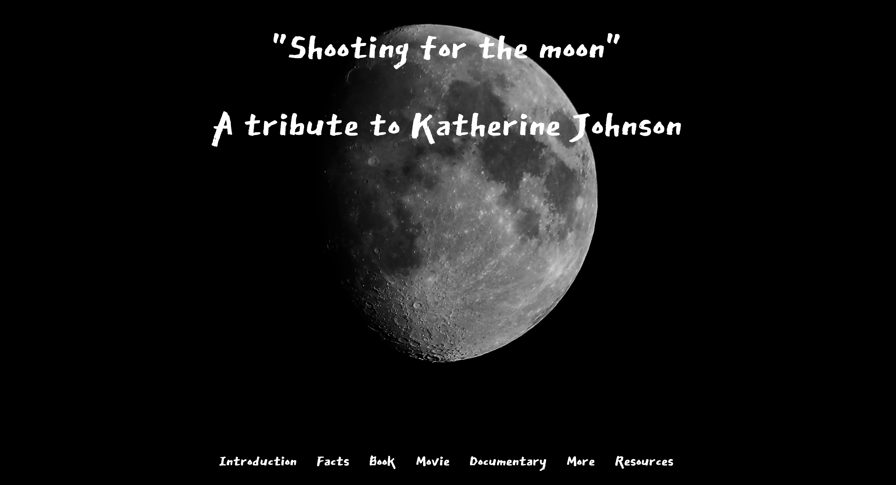

<h1 align="center">"Shooting for the moon" A tribute page to Katherine Johnson</h1>

<h2 align="center">Project made for <a href="https://www.freecodecamp.org/">freeCodeCamp</a> "Responsive Web Design" certification</h2>

---

## The project

### What this project does

##### Project original Users stories:

1. My tribute page should have an element with a corresponding `id="main"`, which contains all other elements
1. I should see an element with a corresponding `id="title"`, which contains a string (i.e. text) that describes the subject of the tribute page (e.g. "Dr. Norman Borlaug")
1. I should see a `div` element with a corresponding `id="img-div"`
1. Within the `img-div` element, I should see an img element with a corresponding `id="image"`
1. Within the `img-div` element, I should see an element with a corresponding `id="img-caption"` that contains textual content describing the image shown in `img-div`
1. I should see an element with a corresponding `id="tribute-info"`, which contains textual content describing the subject of the tribute page
1. I should see an `a` element with a corresponding `id="tribute-link"`, which links to an outside site that contains additional information about the subject of the tribute page. HINT: You must give your element an attribute of `target` and set it to `_blank` in order for your link to open in a new tab (i.e. `target="_blank"`)
1. The `img` element should responsively resize, relative to the width of its parent element, without exceeding its original size
1. The `img` element should be centered within its parent element

##### [See project original description here](https://learn.freecodecamp.org/responsive-web-design/responsive-web-design-projects/build-a-tribute-page)

#### Additionnal Users stories: 
- [x] Sticky navbar & footer
- [x] Embedded video
- [x] Full responsive

### How the project works

##### Built with:
* HTML
* CSS
* Flexbox
* [jQuery](https://jquery.com/)
* JavaScript
* [Google fonts](https://fonts.google.com/) for "East Sea Dokdo" & "Noto Sans KR"
* [Font Awesome](https://fontawesome.com/) for all icons

### [Click here to see the project live](https://codingk8.github.io/shooting-for-the-moon/)
 

---

## General informations, Disclaimers & Ackowledgements

## Author

[Codingk8](https://github.com/codingk8)  
 

## Open-source & contributions

### This is not an open-source project - No contribution expected
 

## Licence

### No licence - Please contact me before re-using part of this code
 

## Academic Honesty Disclaimer

### If you're a freeCodeCamp or a code student, please use this project as an inspiration and write your own code. It's what makes us all better developers :wink:  
 

## Intellectual property and copyrights Disclaimer

##### I wrote the code and share below the credits and copyrights of the contents I've used in the website and that DO NOT belong to me
##### If you encounter mistakes in the attribution of these rights, please be sure to let me know (best contact is on [Twitter](https://twitter.com/codingk8)) so that I can update the information

+ Moon top picture (also used for the favicon) - Credit: photo by [Matthew N](https://unsplash.com/photos/zrzy-NPzccs?utm_source=unsplash&utm_medium=referral&utm_content=creditCopyText) on [Unsplash](https://unsplash.com/?utm_source=unsplash&utm_medium=referral&utm_content=creditCopyText) 
+ <ins>Hidden figures</ins> book and book cover - Copywritgh owners: Margot Lee Shetterly & HarperCollins Publishers
+ "Hidden figures" movie, movie poster & trailer - Copyright owner: Twentieth Century Fox
+ "Katherine G. Johnson" documentary - Copyright owners: [Makers](https://www.makers.com/)
+ <ins>Reaching for the moon</ins>, children book about Katherine Johnson - Author: Katherine Johnson - Publisher: Atheneum Books for Young Readers
+ <ins>Counting on Katherine</ins>, children book about Katherine Johnson - Author: Helaine Becker, Illustrator: Tiemdow Phumiruk, Publisher: Henry Holt and Co.
+ <ins>Katherine Johnson - You should meet</ins>, children book about Katherine Johnson - Author: Thea Feldman, Illustrator: Alyssa Petersen, Publisher: Simon Spotlight
+ Barbie® & Inspiring Women™ - Copyright owner: Mattel
+ Katherine Johnson "at her desk" picture from NASA [here](https://www.nasa.gov/image-feature/katherine-johnson-at-work-1962) - Image Credit: NASA Langley Research Center
+ Apollo 11 picture from NASA [here](https://www.nasa.gov/centers/johnson/about/history/jsc50/as11-40-5875.html) - Image Credit: NASA
 

## Acknowledgements & Resources

A big thank you to my husband who offered me the DVD of the movie that made me discover the fascinating story of Katherine Johnson and her friends, and eventually led me to dig further and to create this website as a code-training project

[Blink effect](https://stackoverflow.com/questions/4894488/blinking-text-cross-browser)  
[Glitch effect](https://codepen.io/derekjp/pen/ozEdgK/) - Not used  
[Texts animations](https://speckyboy.com/css-javascript-text-animation-snippets/)
[Fade in effect](https://codepen.io/stevenlewis/pen/YarNJV)
 
 

---

##### Latest update: 20190412

---
